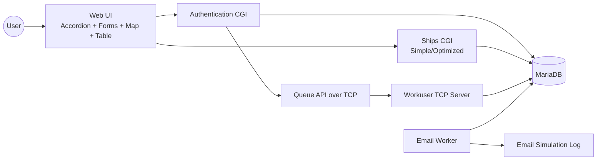
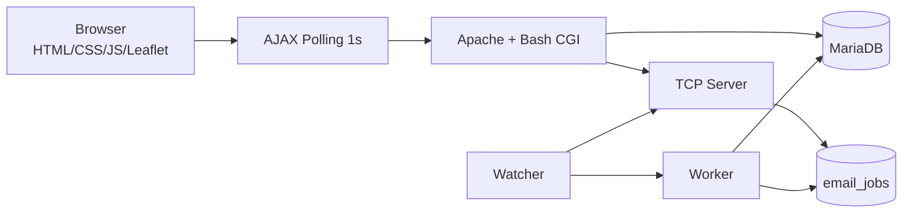

# Report Material (INFRA)

## Use Case Diagram



## Activity Diagram: Login to Email Simulation

```mermaid
flowchart TD
    A[User submits login] --> B[POST /cgi/login.sh]
    B --> C{Credentials valid?}
    C -->|No| D[Return 401 JSON error]
    C -->|Yes| E[Create session + Set-Cookie]
    E --> F[Send TCP request V1|ENQUEUE_EMAIL|JOB_ID|PAYLOAD]
    F --> G{ACK received?}
    G -->|Yes| H[Return success JSON with queue=queued]
    G -->|No| I[Return success JSON with queue=failed]
    F --> J[TCP server validates protocol]
    J --> K[Insert pending job in email_jobs]
    K --> L[Worker claims job]
    L --> M[Write simulation log]
    M --> N[Mark completed]
```

## Architecture / Class-Concept Diagram



## DOM and AJAX Notes

- DOM consists of one accordion with three content groups.
- Exactly one group is shown at a time (login, map, ships).
- Ships polling runs every second with overlap protection.
- Since cursor limits incremental track transfer.

## Sessions and Cookies

- Session cookie: session_id, HttpOnly, SameSite=Lax.
- Session TTL: default 8 hours.
- Session restore via verify_session.sh on page load.
- Expired sessions return 401 and force logged-out UI state.

## Git Notes

- Runtime artifacts are excluded via .gitignore:
  - runtime/
  - monitoring/*.csv, monitoring/*.png
  - tests/*.csv
- Restore of a Git file can be demonstrated with:
  - git checkout -- path/to/file
  - or git restore path/to/file
